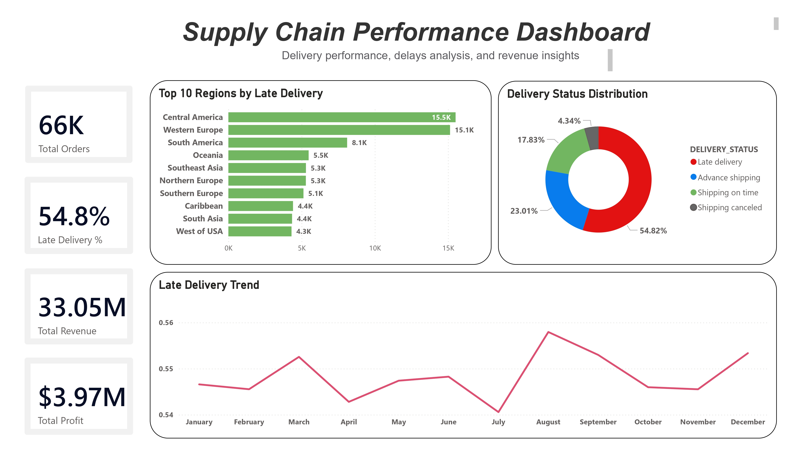

# 📊 Supply Chain Data Analysis (Snowflake + Power BI)

End-to-end data analysis project focused on supply chain performance, delivery delays, and business insights using Snowflake and Power BI.

---

## 🚀 Project Overview
This project analyzes a supply chain dataset to identify key patterns in delivery performance, regional operations, and business efficiency.

The workflow covers the full data pipeline:
- Data extraction
- Data cleaning & validation
- SQL-based analysis (Snowflake)
- Interactive dashboard (Power BI)

---

## ❗ Problem Statement
Businesses often face challenges such as:
- High late delivery rates
- Lack of visibility into regional performance
- Limited insight into operational inefficiencies

This project aims to answer:
- Where do delays happen?
- How do delivery patterns vary across regions?
- What operational insights can be derived from the data?

---

## 📂 Data Source

The dataset used in this project is a public supply chain dataset commonly used for data analysis practice.

It includes:
- Orders data
- Delivery status
- Shipping performance
- Revenue and profit

Note: This dataset is used for educational and analytical purposes only.

---

## 📈 Key Insights

- 📦 Total Orders reached **66K**, indicating a large operational scale  
- 🔴 **54.8% of deliveries are late** → significant operational issue  
- 💰 Total Revenue: **33.05M** and Total Profit: **3.97M**  
- 🌍 Certain regions consistently show higher delay rates  
- 📦 Shipping performance varies across regions  

### 📊 Trend Insights
- 📉 Late delivery rates fluctuate throughout the year  
- 📈 A noticeable peak in delays occurs around August  
- 📉 A relative drop is observed around July  
- ⚠️ These variations may indicate seasonal or operational factors, but additional data is required for confirmation  

### ⚠️ Profit Observation
- 💰 No clear direct relationship was observed between delays and profit  
- ⚠️ However, persistent delays may affect customer satisfaction and long-term business performance  

---

## 💡 Business Recommendations

- Improve logistics in high-delay regions  
- Optimize shipping processes and delivery routes  
- Monitor delivery KPIs regularly  
- Investigate root causes of delays (operations, supply chain inefficiencies)  
- Focus on improving customer experience to maintain trust  

---

## 🧹 Data Cleaning (Snowflake)

- Converted raw data types using `TRY_TO_NUMBER`
- Cleaned inconsistent and invalid values
- Validated:
  - Duplicates
  - Missing values
  - Data quality issues

---

## 📊 Dashboard

### 📷 Dashboard Preview

---

## 📁 Project Files

- SQL Analysis: [analysis.sql](analysis.sql)

---

## 🛠️ Tools Used

- Snowflake (Data Warehouse)
- SQL (Data Cleaning & Analysis)
- Power BI (Visualization & Dashboard)

---

## ⚠️ Data Limitations

- The dataset is a static snapshot (not real-time)  
- Limited available variables (no external factors like weather or disruptions)  
- No direct causal relationship between delays and profit can be confirmed  
- Dataset is used for educational purposes  

---

## 📌 Conclusion

This project demonstrates how data analysis can uncover operational inefficiencies and provide actionable insights to improve business performance.

---

## 🔗 Author

**Amin Suleiman**  
Data Analyst | SQL | Power BI | Snowflake
